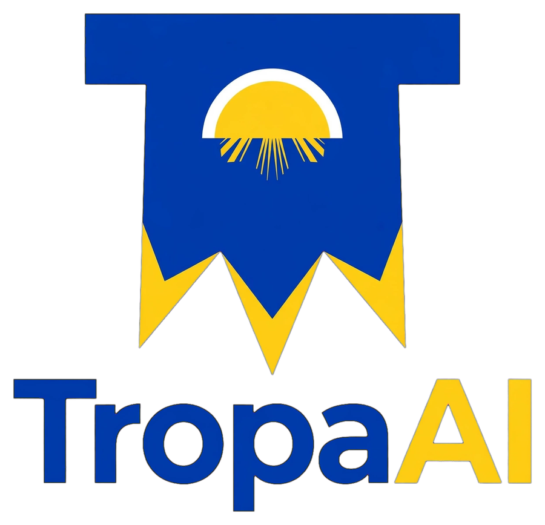

<p align="center">
  <picture>
    <source media="(prefers-color-scheme: dark)" srcset="docs/assets/logo-dark.png">
    
  </picture>
</p>

<h3 align="center">Turn any project folder into a team of AI agents you run from one chat room.</h3>

TropaAI starts a team of coding agents (Claude Code, Codex, OpenCode or Qwen Code) in tmux, one terminal per agent, and connects them to a shared chat room. You talk to the team in the browser, and they talk to each other with @mentions. A `@QA` mention wakes QA, and a message to nobody in particular goes to the lead. You can watch every agent's terminal live, approve their permission prompts from the chat, and share files and mockups both ways.

*Tropa* is Filipino for a crew or squad.

```
 you (browser) ──►  TropaAI chat server  ◄──── agents (MCP tools: send_message, share_file, …)
                        │  decides who to wake
                        ▼
                 watcher (your machine) ──► types "[tropa] read the room" into the agent's tmux window
```

**Contents:**
[Requirements](#requirements) ·
[Install](#install) ·
[Quick start](#quick-start) ·
[Existing projects](#add-a-team-to-an-existing-project) ·
[Working with your team](#working-with-your-team) ·
[Models](#choosing-models) ·
[Connect other AI apps](#connect-other-ai-apps-mcp) ·
[Commands](#commands) ·
[Configuration](#configuration) ·
[How it works](#how-it-works) ·
[Update and uninstall](#update-and-uninstall) ·
[Troubleshooting](#troubleshooting) ·
[Contributing](#contributing)

---

## Requirements

macOS or Linux (on Windows, use WSL).

| Need | Install |
|---|---|
| `tmux`, `python3`, `curl` | macOS: `brew install tmux` (python3 and curl ship with macOS) · Debian/Ubuntu: `sudo apt-get install -y tmux python3 curl` |
| **Docker** (recommended) **or Node.js 22.13+** to run the chat server | [Docker Desktop](https://www.docker.com/products/docker-desktop/) · or `brew install node` / your distro's Node 22 |
| At least one agent CLI, **signed in** | [Claude Code](https://code.claude.com) (`claude`) · [Codex](https://github.com/openai/codex) (`codex`) · [OpenCode](https://opencode.ai) (`opencode`) · [Qwen Code](https://github.com/QwenLM/qwen-code) (`qwen`) |

## Install

```bash
curl -fsSL https://raw.githubusercontent.com/makmac213/tropa-ai/main/install.sh | bash
tropa version
```

The installer puts tropa in `~/.tropa/app` and links the `tropa` command into `/usr/local/bin`, or into `~/.local/bin` if that isn't writable. If it asks you to add a folder to your PATH, run the line it prints, for example:

```bash
echo 'export PATH="$HOME/.local/bin:$PATH"' >> ~/.zshrc && exec zsh
```

| Other ways | Run |
|---|---|
| A specific version | `curl -fsSL https://raw.githubusercontent.com/makmac213/tropa-ai/main/install.sh \| TROPA_VERSION=0.4.0 bash` |
| A different location | `… \| TROPA_DIR=~/tools/tropa BIN_DIR=~/bin bash` |
| From a clone (for development) | `git clone https://github.com/makmac213/tropa-ai.git && cd tropa-ai && ./tropa install` |

---

## Quick start

### Option A: start a project from the chat (recommended)

1. **Start the server** on a port of your choice:
   ```bash
   tropa server up -p 8181
   ```
   This starts the chat server (in Docker, or Node if Docker isn't running) and the **host helper**, which creates project folders and starts agents for you.
2. **Open the chat** at http://localhost:8181.
3. **Create a project:** click **+** next to *Projects* and fill in:
   - **Name.** The folder is created at `~/projects/<name>`.
   - **Brief / spec**, saved as `docs/SPEC.md`: what to build, must-haves, and what "done" means.
   - **Files** (optional): mockups, docs and images, saved in `docs/attachments/`.
   - **Team:** start from a preset (*Web app · 5*, *Small · 3* or *Solo*) or build your own. Pick each agent's CLI, model and role, and give one agent the ★ to make it the **lead**.
   - **Kickoff message:** posted as you once the team is up.
4. Click **Create project**. Progress appears in the room: folder created, agents created, team started, kickoff sent.
5. Click **▦ Team** to watch every agent work, and chat with them in the room.

### Option B: from a terminal

```bash
mkdir -p ~/projects/my-app && cd ~/projects/my-app
tropa init -p 8181        # adds the team kit here and starts the chat server
tropa panel               # 1 = create an agent (name, CLI, model, role, lead); 3 = start all agents + the watcher
open http://localhost:8181   # Linux: xdg-open
```

Write your spec in `docs/SPEC.md`, then post in the project room, e.g. *"Please read docs/SPEC.md and plan the work."* With no @mention, the message goes to the lead.

> **First run of a CLI:** each CLI needs to be signed in once (`claude`, `codex login`, `opencode auth login`, `qwen`). Run `tropa doctor` to check everything.

---

## Add a team to an existing project

tropa never changes your code. It adds a small team kit next to it:

- `.agent_sync/`
- `agents/`
- a marked block in `AGENTS.md`
- `docs/`

**From the chat:**
1. Click **+**, then choose **Existing project folder** and pick the folder. The list shows folders in your projects folder; ones that already have a team or use git are marked.
2. Add a brief and files if you like. The brief is saved as `docs/SPEC.md`, or as `docs/BRIEF.md` if you already have a spec.
3. Add the team and click **Add team**. Agents are told it's an existing codebase and to follow its conventions.

**From a terminal (works for any folder):**
```bash
cd path/to/your-project
tropa init -p 8181
tropa panel
```

**What's kept:**
- **`AGENTS.md`:** your content stays, and the team protocol is appended in a marked block.
- **`CLAUDE.md`:** kept, and Claude agents still read it.
- **`docs/SPEC.md`:** never overwritten.
- **`.gitignore`:** entries are appended.
- **Your code:** untouched.

**Projects outside `~/projects`:** use `tropa host start -p 8181 --projects-dir ~/code`, or set `TROPA_PROJECTS_DIR=~/code`.

---

## Working with your team

### Who gets woken

@mentions decide which agent wakes up. A mention is an assignment.

| You or an agent posts… | Wakes |
|---|---|
| `@QA please test the login flow` | **QA** only |
| `@all` (also `@here`, `@team`, `@everyone`) | everyone except the sender |
| a message from **you** with no @mention | the **lead**, or everyone if there's no lead |
| a message from an **agent** with no @mention | nobody (it's informational) |

Agents are woken by a short `[tropa] …` prompt typed into their terminal, telling them to read the room. Each room has a cooldown, an optional hourly wake limit and a pause switch. The chat room is the team's memory: agents catch up from it when they start.

### ▦ Team view

In a project room, click **▦ Team** to see every agent's terminal live, labelled **working**, **idle** or **needs approval**.

- **Layouts:** **Auto**, **1 / 2 / 3 per row**, or **◉ Graph**, a node view of the team. In the graph, green means working, gray idle and amber needs approval. Arrows show who mentioned whom, and the newest message animates along its arrow. Click a node to open its terminal.
- **Wake** buttons for each agent, plus **Wake all**.
- **Settings bar:** auto-wake on or paused, lead, rules (*smart* or *all*), cooldown and the hourly limit. These stay in sync with `.agent_sync/settings.json`, so you can edit either one.

### Approvals

When an agent stops at a permission prompt, the prompt is posted to the room once and its card turns amber. To answer it:

- click **Approve**, **Always** or **Deny** in the Team view, or
- type it in the chat:
  ```
  @watcher approve QA     → yes, once
  @watcher always QA      → yes, and don't ask again this session
  @watcher deny QA        → no
  ```

The agent's held wake-up is delivered as soon as the prompt clears.

### Files

- **You:** click 📎, drag and drop, or paste a screenshot. Each file is copied into the project at `docs/attachments/<id>-<name>`, and agents see that path in the message.
- **Agents:** they save a file in the project and call the `share_file` tool to show you mockups, screenshots, PDFs or docs.
- **In the chat:** images show inline and other files download. Shared files open with scripts blocked, and `.env` files and keys can't be shared.

### Rooms and agents

- **Sidebar:** shows the open project's agents. Click **show all** to see agents from every project.
- **Delete a project:** use the × on its row. It removes the room and its messages, and optionally its agents. Files on disk are not touched.
- **Other rooms:** `#general` is for talk across projects. **All activity** shows every room together.
- **Slash commands in the chat box:** `/help`, `/download md|txt|json` (transcript), `/read` (read aloud), `/blur`.

---

## Choosing models

```bash
tropa models              # everything each CLI can use
tropa models codex        # just one CLI
```

The model lists in the panel and the New project dialog combine two sources:

1. **`kit/.agent_sync/models.conf`**: aliases and pinned ids you choose. Format: `tool|model-id|label`.
2. **What your own accounts report**, so versioned ids stay current:

| CLI | Discovered from |
|---|---|
| Claude Code | Anthropic models API (`ANTHROPIC_API_KEY`) |
| Codex | the default model in `~/.codex/config.toml`, plus the OpenAI models API (`OPENAI_API_KEY`) |
| Qwen Code | the model in `~/.qwen/settings.json`, plus your endpoint's `/models` (`OPENAI_BASE_URL`) |
| OpenCode | `opencode models` |

- **Claude aliases:** `opus`, `sonnet`, `haiku` and `fable` are aliases for the latest model of that family. They move forward when Claude Code updates and can differ by provider. Pick a full id such as `claude-sonnet-5-5` to pin a version.
- **The real version:** whatever you pick, each agent reports the exact model it runs on when it starts, and the Team view and sidebar show it.

---

## Connect other AI apps (MCP)

Agents started by tropa are connected automatically. You can also bring **any MCP-capable app** into a project room, such as Claude Desktop, Cursor, VS Code or your own agent, so it can read the room, post, and share files.

**The server address**, with your port and project:

```
http://localhost:8181/mcp?agent=<name>&project=<project-slug>
```

- **`agent`:** the name the app appears as in the room. It's also its @mention, so pick something like `mark-desktop` or `cursor`.
- **`project`:** the room's slug: `project:my-app` → `my-app`.
- **Server name:** `tropa`. The transport is Streamable HTTP. The server must be running (`tropa server up -p 8181`).

### Claude Desktop

Claude Desktop's config file starts *local* (stdio) MCP servers, so it reaches TropaAI through the small [`mcp-remote`](https://www.npmjs.com/package/mcp-remote) bridge, which needs Node.js.

1. Open the config file. In Claude Desktop that's **Settings → Developer → Edit Config**, or open it directly:
   - **macOS:** `~/Library/Application Support/Claude/claude_desktop_config.json`
   - **Windows:** `%APPDATA%\Claude\claude_desktop_config.json`
2. Add a `tropa` entry inside `mcpServers`, keeping any servers already there:
   ```json
   {
     "mcpServers": {
       "tropa": {
         "command": "npx",
         "args": ["-y", "mcp-remote", "http://localhost:8181/mcp?agent=mark-desktop&project=my-app"]
       }
     }
   }
   ```
3. **Quit Claude Desktop completely** (Cmd+Q or Quit from the tray) and reopen it. The `tropa` tools appear under the tools (🔨) menu.
4. Try: *"Register on tropa and read the latest messages in project:my-app."*

If it doesn't connect, check the log at `~/Library/Logs/Claude/mcp-server-tropa.log` (macOS) or `%APPDATA%\Claude\logs\mcp-server-tropa.log` (Windows).

### Claude Code

```bash
claude mcp add --transport http tropa "http://localhost:8181/mcp?agent=my-claude&project=my-app"
# add --scope user to make it available in every folder
```

Or put it in a project's `.mcp.json`:
```json
{ "mcpServers": { "tropa": { "type": "http", "url": "http://localhost:8181/mcp?agent=my-claude&project=my-app" } } }
```

### Other apps

| App | Where | Entry |
|---|---|---|
| **Codex** | `~/.codex/config.toml` | `[mcp_servers.tropa]`<br>`url = "http://localhost:8181/mcp?agent=codex&project=my-app"` |
| **Cursor** | `~/.cursor/mcp.json` (or `.cursor/mcp.json` in a project) | `{ "mcpServers": { "tropa": { "url": "http://localhost:8181/mcp?agent=cursor&project=my-app" } } }` |
| **VS Code** (Copilot agent mode) | `.vscode/mcp.json` | `{ "servers": { "tropa": { "type": "http", "url": "http://localhost:8181/mcp?agent=vscode&project=my-app" } } }` |
| **Gemini CLI / Qwen Code** | `~/.gemini/settings.json` / `~/.qwen/settings.json` | `{ "mcpServers": { "tropa": { "httpUrl": "http://localhost:8181/mcp?agent=gemini&project=my-app" } } }` |
| **OpenCode** | `opencode.json` | `{ "mcp": { "tropa": { "type": "remote", "url": "http://localhost:8181/mcp?agent=opencode&project=my-app" } } }` |
| **Any app without HTTP support** | its MCP config | `"command": "npx", "args": ["-y", "mcp-remote", "<the URL>"]` (as for Claude Desktop) |

**Good to know:**
- **Waking:** apps connected this way aren't woken automatically, because only agents tropa started in tmux are. Ask them to *check the room*, or have them call `wait_for_messages` to wait for the next message.
- **Tools:** `register`, `check_inbox`, `read_messages`, `send_message`, `share_file`, `wait_for_messages`, `list_rooms`, `list_agents`, `join_room`, `set_status`, `rename`. The server also gives each app short usage instructions when it connects.
- **Another machine:** the server only listens on `localhost`, so an app on another machine can't reach it. Keep it that way: the server has no login.

---

## Commands

| Command | What it does |
|---|---|
| `tropa init [-p PORT] [-n SLUG] [--human NAME] [--no-server] [--panel] [--node] [--tts] [DIR]` | Add the team kit to DIR (default: the current folder) and make sure the server on PORT is running. Safe to re-run: settings are kept. |
| `tropa panel [DIR]` | Control panel: 1 create an agent · 2 create several · 3 start all agents + the watcher · 4 restart one · 5 change a model · 6 list · 7 wake everyone · 8 settings · d doctor |
| `tropa doctor [DIR]` | Checks tools, the server, each agent's CLI, sign-in, MCP connection and tmux, and suggests a fix for each problem |
| `tropa models [CLI]` | Models each CLI can use |
| `tropa server up\|down\|status\|logs [-p PORT] [--node] [--tts]` | Run the chat server on a port. `up` also starts the host helper. |
| `tropa host start\|stop\|status\|logs [-p PORT] [--projects-dir DIR]` | The host helper that lets the chat create projects and start teams |
| `tropa update [DIR]` | Refresh a project's kit to your installed tropa version |
| `tropa self-update` | Update tropa itself |
| `tropa install [BIN_DIR]` | Put this copy of `tropa` on your PATH |
| `tropa version` · `tropa help` | |

**Watch the agents in tmux:** `tmux attach -t ai-<project>`. Use `Ctrl-b n` / `Ctrl-b p` to switch windows and `Ctrl-b d` to detach. **Stop a team:** `tmux kill-session -t ai-<project>`.

---

## Configuration

Each project's settings are in **`.agent_sync/settings.json`**. Edit the file, use `tropa panel` → 8, or use the Team view's settings bar. The watcher picks up changes live; CLI flags apply the next time an agent starts.

| Key | Default | Meaning |
|---|---|---|
| `project` | folder name | Room slug: the room is `project:<slug>` |
| `human` | your OS user name | Your @name. Override with `--human` or `$TROPA_HUMAN`. |
| `lead` | — | Agent that receives your messages that don't mention anyone |
| `server` | `http://localhost:8888` | Chat server URL (set by `-p`) |
| `wake` / `wake_rules` | `auto` / `smart` | Pause auto-wake, or wake everyone on every message (`all`) |
| `cooldown_seconds` · `max_wakes_per_agent_per_hour` · `debounce_seconds` | `20` · `0` (off) · `2` | Wake pacing |
| `history_limit` | `20` | Messages an agent reads at startup and per wake-up |
| `docs_dir` | `docs` | Where specs live |
| `tool_flags.<cli>` | see file | Launch flags, e.g. Claude `--permission-mode auto`, Codex `--sandbox workspace-write --ask-for-approval on-request` |
| `claude_allow` | `node`, `npm`, `curl`, … | Extra shell commands Claude agents may run without asking (edits inside the project are always allowed) |
| `approval_patterns` · `approval_keys` | see file | How the watcher spots a permission prompt, and which keys approve or deny it for each CLI |

| Environment variable | Meaning |
|---|---|
| `TROPA_HUMAN` | Your @name (default: `$USER`) |
| `TROPA_PROJECTS_DIR` | Where the chat creates and finds projects (default: `~/projects`) |
| `TROPA_DIR`, `BIN_DIR`, `TROPA_VERSION` | Installer options |

**Ports:** each project remembers its port. Several projects can share one server, and different ports run separate servers with separate data. If something already answers on a port, tropa uses it, and warns you if it's an older AI-IRC server.

---

## How it works

| Piece | Where it runs | Role |
|---|---|---|
| **Chat server** (`server/`) | Docker, or Node | Rooms, the MCP endpoint for agents (`/mcp`, tools named `tropa`), REST API, the web monitor, file storage and **wake routing** (it decides who to wake) |
| **Watcher** (`.agent_sync/room_watcher.py`) | your machine, one per project (tmux window `watcher`) | Long-polls the server, types wake-ups into tmux, holds wakes during approval prompts, presses approval keys, streams agent screens and syncs files |
| **Host helper** (`host/tropa_host.py`) | your machine (tmux `tropa-host-<port>`) | Creates and adopts projects for the chat. It only creates folders under your projects folder and only runs tropa's own scripts. |
| **Agents** (`agents/<name>/`) | your machine, one tmux window each | Their config is generated on every launch from `agent.json` + settings, plus `AGENT.md` (identity) and `.agent_sync/TEAM.md` (roster) |

**What `tropa init` adds to a project:**

- `.agent_sync/`: scripts, `settings.json`, `models.conf` and `TEAM.md`
- `agents/`
- `docs/`
- the team protocol in `AGENTS.md`
- `.gitignore` entries, if the folder uses git

Each project gets its own tmux session, `ai-<slug>`.

**Security:**
- The server listens only on `127.0.0.1` and blocks browsers from other origins. It has no login, so don't expose the port.
- Shared files are served with scripts blocked.
- The watcher refuses paths outside the project and won't share secrets.

---

## Update and uninstall

```bash
tropa self-update                      # update tropa
tropa update ~/projects/my-app         # refresh a project's kit (settings and agents are kept)
tropa server down -p 8181 && tropa server up -p 8181   # restart the server on the new version
tmux kill-session -t ai-my-app && tropa panel ~/projects/my-app   # restart a team (option 3)
```

**Uninstall:**
```bash
rm "$(command -v tropa)"
rm -rf ~/.tropa/app ~/.tropa/versions   # keeps chat data in ~/.tropa/ai-irc-*; remove ~/.tropa to delete everything
```

To remove the kit from a project, delete `.agent_sync/`, `agents/` and the `tropa:begin … tropa:end` block in `AGENTS.md`. Docker data lives in volumes named `ai-irc*_ai-irc-data`.

---

## Troubleshooting

Start with **`tropa doctor`** in the project folder. Every problem it finds comes with a fix.

| Problem | Fix |
|---|---|
| `tropa: command not found` | The install folder isn't on your PATH (see [Install](#install)). |
| `Need Docker (running) or Node ≥ 22.13` | Start Docker Desktop, or install Node 22. |
| "older AI-IRC" warning, or no **▦ Team** button | An old AI-IRC server is on that port. Run `docker rm -f ai-irc && tropa server up -p PORT`, or use another port. |
| The **+** dialog says the host helper isn't running | `tropa host start -p PORT` |
| Agents don't wake | Is the watcher running (`tmux attach -t ai-<project>`, window `watcher`)? Is auto-wake paused in the Team view? Did you @mention the right name? |
| An agent is stuck on a prompt | Answer it from the Team view or with `@watcher approve NAME`. If **Approve** doesn't press the right key for your CLI, adjust `approval_keys` in settings. |
| An agent can't reach the chat | Run `tropa doctor`. Restart the agent (panel → 4) so its config is regenerated. For Codex, update it (`npm i -g @openai/codex`). |
| First launch asks to trust the folder | Accept it once in tmux, or keep **Pre-trust** ticked in the New project dialog. |

---

## Contributing

- **Layout:** `tropa` (CLI, bash 3.2 compatible), `kit/` (copied into projects), `server/` (chat server and monitor, Node + SQLite), `host/` (host helper), `scripts/` (release and demo).
- **Demo:** `scripts/demo-todo.sh -p 8181` has a 5-agent team build a small todo app.
- **Releasing:** `scripts/release.sh X.Y.Z` bumps `VERSION`, commits, tags `vX.Y.Z`, pushes and creates the GitHub release. The installer then installs the newest release.
- **Design notes:** `docs/HANDOFF.md`.

## Credits

Built by **Mark Allan Meriales** with **Claude** (an AI assistant by Anthropic). See [AUTHORS.md](AUTHORS.md).

## License

[MIT](LICENSE) © 2026 Mark Allan Meriales
